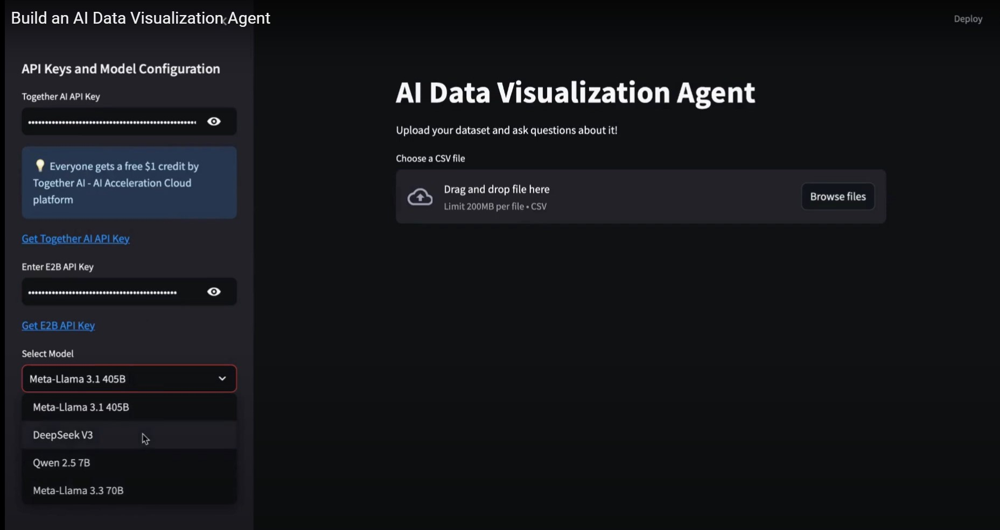
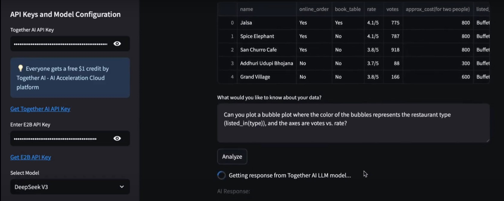
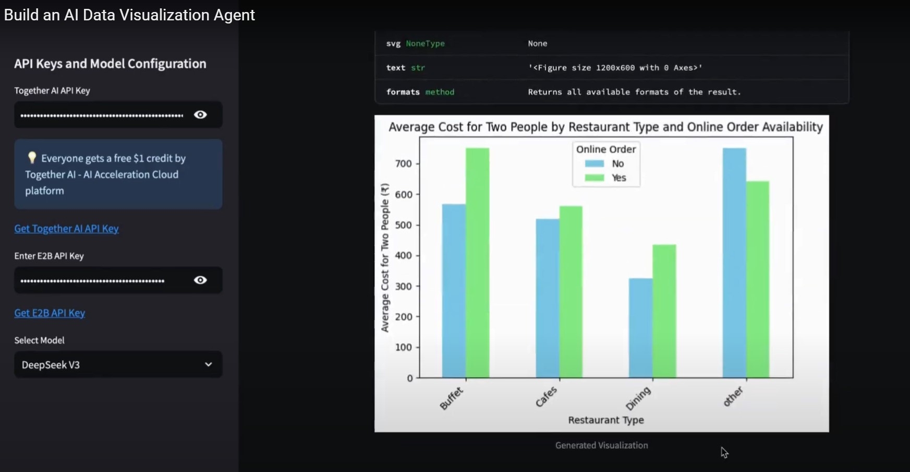
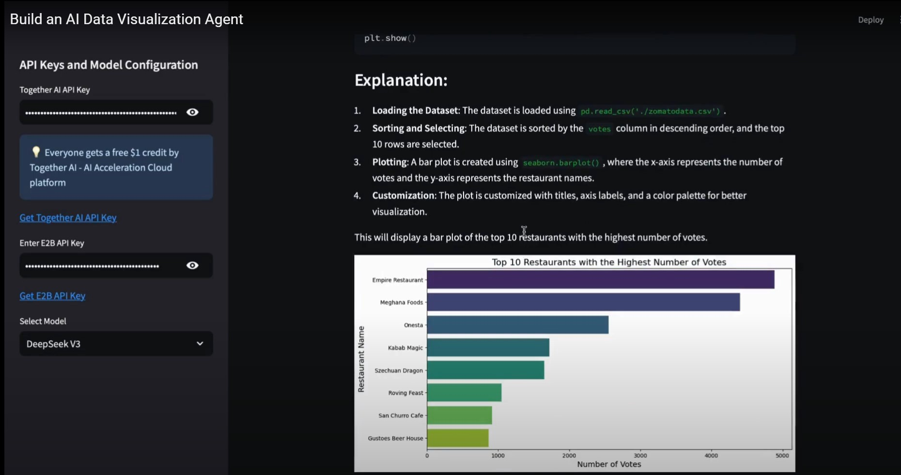

# 📊 AI Data Visualization Agent

An intuitive AI-powered data visualization assistant that understands natural language queries and transforms raw datasets into meaningful visual insights. Built with [Together AI](https://www.together.ai/)’s advanced language models and powered by [E2B](https://e2b.dev/)'s secure code execution environment, this tool makes data exploration seamless and intelligent.

---

## 🚀 Project Overview

As the demand for smarter, faster data analysis grows, traditional tools are no longer enough. This project introduces an **AI Data Visualization Agent** that combines the power of LLMs and sandboxed execution to let users query their data naturally and visualize results instantly — all from a browser.

Whether you're a data scientist, analyst, educator, or enthusiast, this application makes it incredibly easy to upload datasets, ask complex questions, and receive insightful answers with dynamic visualizations.




---

## 🎯 Core Features

### 💬 Natural Language Analysis  
- Ask questions about your dataset in plain English  
- Receive dynamic visualizations and statistical summaries  
- Understand patterns, distributions, and relationships with ease  
- Continue interactive questioning for deeper insights

### 📊 Intelligent Visualization Engine  
- Automatically selects the best-suited chart (bar, line, scatter, pie, bubble, etc.)  
- Visualizations styled for clarity and insight  
- Handles data preprocessing like cleaning, null handling, renaming, and formatting

### 🔐 Secure Execution Environment  
- Uses E2B’s sandbox to safely run AI-generated Python code  
- No local code execution needed — security-first design

### 🧠 Multi-Model LLM Support  
Choose from top-performing open-source models depending on the complexity of your task:
- **Meta-Llama 3.1 (405B)** – Best for deep analytical tasks  
- **Meta-Llama 3.3 (70B)** – Ideal for advanced queries  
- **DeepSeek V3** – Suitable for detailed insights  
- **Qwen 2.5 (7B)** – Fast, lightweight option for quick lookups  

---

## 🖥 Interactive User Experience

Built with [Streamlit](https://streamlit.io), the UI enables:
- 📁 Easy CSV file upload  
- 📌 Real-time visualization generation  
- 🔄 Re-asking or refining queries interactively  
- ✨ Polished and responsive user interface




---

## 🛠️ How to Run the App Locally

### 🔑 Get API Keys
Before starting, ensure you have the necessary credentials:
- **Together AI API Key** → [Get here](https://api.together.ai/signin)  
- **E2B API Key** → [Get here](https://e2b.dev) and refer to their [API Docs](https://e2b.dev/docs/legacy/getting-started/api-key)

### 📥 Clone the Repository

```bash
git clone https://github.com/vishal-benake/LLM-data-visualization-Agent.git
cd LLM-data-visualization-Agent
```

### 📦 Install Dependencies

```bash
pip install -r requirements.txt
```

### ▶️ Launch the Streamlit App

```bash
streamlit run main.py
```

---

## 📣 Stay Connected

If you found this project useful or inspiring, consider supporting it with a ⭐ on GitHub!

### 🔗 Follow for Updates and Content

- 🎥 **YouTube – [Code With Vishal](https://www.youtube.com/@Code-With-Vishal)**  
  Tutorials, project demos, and coding walkthroughs

---

## 🙌 

This project serves as a practical demonstration of:
- **Together AI’s large language model APIs**
- **E2B’s secure and scalable code interpreter**

Ideal for learners, startups, or developers exploring AI in the context of real-time data interpretation.

---

> Empowering the future of AI-driven data storytelling.
